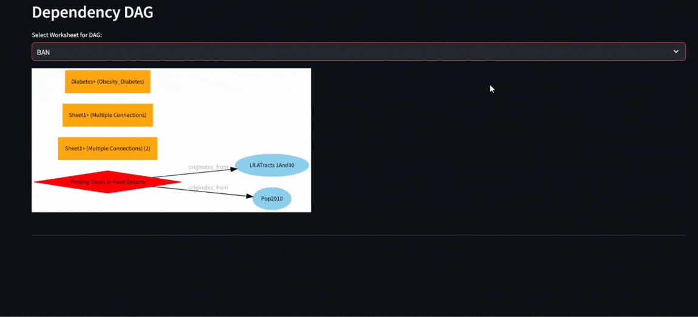

# Tableau Report Gen

[](https://test.pypi.org/project/tableau-report-gen/)
[](https://test.pypi.org/project/tableau-report-gen/)
[](https://streamlit.io/)
[](https://opensource.org/licenses/MIT)


## Table of Contents

- [Features](#features)
- [Demo](#demo)
  - [Public Tableau Reports](#public-tableau-reports)
- [Installation](#installation)
  - [System Dependencies](#system-dependencies)
  - [Python Package](#python-package)
- [Usage](#usage)
- [Development](#development)
  - [GitHub File Structure](#github-file-structure)
  - [Deployment to Test and Live PyPI](#deployment-to-test-and-live-pypi)
    - [Prerequisites](#prerequisites)
    - [Step 1: Build the Package](#step-1-build-the-package)
    - [Step 2: Upload to Test PyPI](#step-2-upload-to-test-pypi)
    - [Step 3: Test the Package](#step-3-test-the-package)
    - [Step 4: Upload to Live PyPI](#step-4-upload-to-live-pypi)
    - [Notes](#notes)
  - [Setting Up CI/CD Pipeline with GitHub Actions](#setting-up-cicd-pipeline-with-github-actions)
  - [Developer Contact](#developer-contact)
- [License](#license)

## Features

- **Upload Tableau Workbook:** Easily upload your `.twbx` files.
- **Comprehensive Reports:** Generate detailed reports covering various aspects of your workbook.
- **Dependency DAG:** Visualize dependencies between calculated fields and original columns.
- **Export Options:** Download reports in HTML or PDF formats.



### Public Tableau Reports

Here are some public Tableau reports compatible with our application:

1. [Finding Oases In Food Deserts](https://public.tableau.com/app/profile/corey.jones/viz/FindingOasesInFoodDeserts/Dashboard1)
2. [Choose Background Color](https://public.tableau.com/app/profile/ritesh.bisht/viz/ChooseBackgroundColor_16843492447710/Improved_UI_2)
3. [State Medigap Costs](https://public.tableau.com/app/profile/lindsay.betzendahl/viz/StateMedigapCosts-ProjectHealthViz/Medigap)

## Installation

### System Dependencies

This package requires [Graphviz](https://graphviz.org/) to be installed on your system.

- **Windows:**
  - Download the installer from the [Graphviz Download Page](https://graphviz.org/download/) and follow the installation instructions.
  - Ensure that the `bin` directory (e.g., `C:\Program Files\Graphviz\bin`) is added to your system's `PATH`.

- **macOS:**
  Install Graphviz via Homebrew:
  ```bash
  brew install graphviz
  ```

- **Linux:**
  Install Graphviz via APT:
  ```bash
  sudo apt-get install graphviz
  ```

### Python Package

**Note:** This package **only supports Python version `3.12` and above.** Please ensure you are using a compatible Python version.

Install the package using `pip`:

```bash
pip install tableau-report-gen
```

## Usage

After installation, you can run the Streamlit app via the command line:

```bash
trggo
```

This will launch the app in your default web browser. Follow the on-screen instructions to upload your `.twbx` file and generate reports.

## Development

This section provides an overview of the project's file structure, deployment processes, CI/CD pipeline setup, and developer contact information.

### GitHub File Structure

Understanding the repository's file structure is essential for effective development and collaboration. Below is a breakdown of the key files and directories:

```plaintext
build/
tableau_parser_app/
├── app.py
├── components/
│   └── uploader.py
├── parser/
│   └── tableau_parser.py
├── utils/
│   ├── dag.py
│   ├── helpers.py
│   └── report.py
├── logs/
.gitignore
Dockerfile
LICENSE
pyproject.toml
README.md
requirements.txt
setup.py
```

- **build/**: Contains build artifacts and compiled files.
- **tableau_parser_app/**: Main application directory.
  - **app.py**: Entry point of the Streamlit application.
  - **components/**: Reusable UI components.
    - **uploader.py**: Handles file upload functionality.
  - **parser/**: Modules related to parsing Tableau workbooks.
    - **tableau_parser.py**: Core parser logic for `.twbx` files.
  - **utils/**: Utility scripts and helper functions.
    - **dag.py**: Generates Dependency DAG visualizations.
    - **helpers.py**: Contains helper functions used across the app.
    - **report.py**: Manages report generation and export.
- **logs/**: Directory for log files.
- **.gitignore**: Specifies files and directories to be ignored by Git.
- **Dockerfile**: Configuration for Docker containerization.
- **LICENSE**: Licensing information.
- **pyproject.toml**: Project metadata and build configuration.
- **README.md**: Project documentation.
- **requirements.txt**: Python dependencies required for the project.
- **setup.py**: Setup script for packaging and distribution.

## Deployment to Test and Live PyPI

Deploying your package to PyPI involves two main steps: publishing to Test PyPI for testing purposes and then to the Live PyPI for public distribution.

### Prerequisites

- Ensure you have an account on [PyPI](https://pypi.org/) and [Test PyPI](https://test.pypi.org/).
- Install necessary tools:
  ```bash
  pip install setuptools twine
  ```

### Step 1: Build the Package

Navigate to the root directory of your project and run:

```bash
python setup.py sdist bdist_wheel
```

This command generates the source distribution and wheel files in the `dist/` directory.

### Step 2: Upload to Test PyPI

```bash
twine upload --repository-url https://test.pypi.org/legacy/ dist/*
```

- **Username and Password:** You'll be prompted to enter your Test PyPI credentials.

### Step 3: Test the Package

Install the package from Test PyPI to ensure it's working as expected:

```bash
pip install --index-url https://test.pypi.org/simple/ tableau-report-gen
```

### Step 4: Upload to Live PyPI

Once testing is successful, upload the package to the live PyPI:

```bash
twine upload dist/*
```

- **Username and Password:** Enter your PyPI credentials when prompted.

---

### CI/CD Workflow

Our CI/CD pipeline is managed entirely through GitHub Actions using the `.github/workflows/ci.yml` file. This file performs the following functions:

- **Triggering Events:**  
  The pipeline is automatically triggered on pushes, pull requests to the `main` branch, or through manual invocation using GitHub’s workflow_dispatch.

- **Build and Test:**  
  - Sets up a Python (3.12) environment.
  - Installs the necessary dependencies from `requirements.txt`.
  <!-- - Runs code linting (with flake8) to ensure code quality. -->
  - Executes the test suite (using pytest) to catch issues early.

- **Deployment (Optional):**  
  If configured, the workflow can automatically build and package your application. There is an optional step to deploy the package (for example, to PyPI) which can be enabled by uncommenting the relevant lines and setting up the appropriate secrets.

This single file is the heart of our automation process, ensuring that every change is built, tested, and optionally deployed with minimal manual intervention. 

---
### Developer Contact

*Coming Soon*

## License

This project is licensed under the MIT License - see the [LICENSE](LICENSE) file for details.